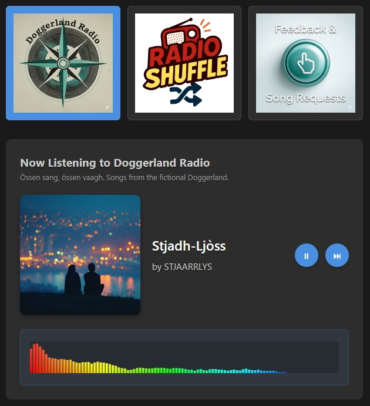

# AI Radio App

A web app that simulates radio stations with AI-generated music, announcements, and cover art. Eight fictional stations, each with its own genre and personality. Switch stations, skip tracks, and listen to DJ idents between songs. Just like real radio, except nothing is real.

Try it live → https://www.biomi.org/radio/?utm_source=github

<a href="https://www.biomi.org/radio/?utm_source=github">
  
</a>

## Overview

- **`index.html`**: Main HTML structure.
- **`script.js`**: Contains `AudioVisualizer` class and `RadioApp` class with all app logic. All app state lives in `RadioApp.state` - this makes it easy to see what the app knows at any time.
- **`config.js`**: Station definitions and song lists.
- **`style.css`**: All styling in one file.
- **`announcements/`**: DJ idents/announcements (mp3)
- **`audio/`**: Song files (mp3)
- **`cover_art/`**: Album artwork (jpg, 512 x 512 px)
- **`station_art/`**: Station logos,  (png, 256 x 256 px)

## Development Guidelines

### Simplicity First
- This is a small project that will never expand into a large or complex mission-critical system, so Favor simple solutions over complex ones
- Don't over-engineer, don't do premature optimization. Solve the actual problem, not hypothetical future problems
- Don't prepare for very long `config.js` files - it will stay manageable

### Code Organization
- All app state is consolidated in a single `this.state` object in the `RadioApp` class
- Keep the architecture simple and understandable for AI programming tools
- Use clear comments to explain "why" not "what" - make the code self-documenting where possible

### Constraints & Assumptions
- You can assume all audio and image files exist - there's another mechanism that ensures this
- Keep version numbers in cache-busting query strings (e.g., `?v=2.1`) - these are required
- Keep `console.log` statements in production code - they're intentional for debugging

### Browser Compatibility and Error Handling
- Mobile support is important
- Graceful degradation: If a feature isn't supported or something goes wrong, selecting a station and playing music should still work
- Log errors with context: Include relevant information (which song, which station) in error logs


## Setup

### First time setup

```bash
# Create virtual environment
python3.10 -m venv venv

# Activate virtual environment
source venv/bin/activate

# Install dependencies
pip install -r requirements.txt
```

## Daily Usage

```bash
# Start working
source venv/bin/activate
```

```bash
# View the app
python -m http.server 8080
```

Open http://localhost:8000 in your browser.

```bash
# Stop the app
Ctrl+C
source venv/bin/deactivate
```

```bash
# Stop if process is stuck
lsof -ti :8080 | xargs kill -9
```

# Ideas

## Refactoring:

High priority

Extract magic numbers to a named constants section
Move 1500 (pause duration), 256 (fftSize), 0.8 (data length multiplier) to a CONSTANTS object at the top of the file

Medium priority

Add debouncing/throttling to prevent rapid button clicks
Prevent multiple rapid clicks on play/pause or next during transitions
Use a simple flag or small delay to ignore clicks during isTransitioning
Prevents race conditions and audio glitches

Add error boundaries around critical audio operations
Wrap audio.play(), audio.load(), and visualizer connection in try-catch
Log errors with context (which song, which station)
Prevents one failed song from breaking the entire app

Document the audio element connection pattern
Add a comment explaining why connectAudio checks for existing connections
Clarify the Web Audio API connection chain (source → analyser → destination)
Helps AI tools understand the audio pipeline

## Other:

Station history: Show recently played songs

Commercial, weather (real?), news updates, traffic updates
